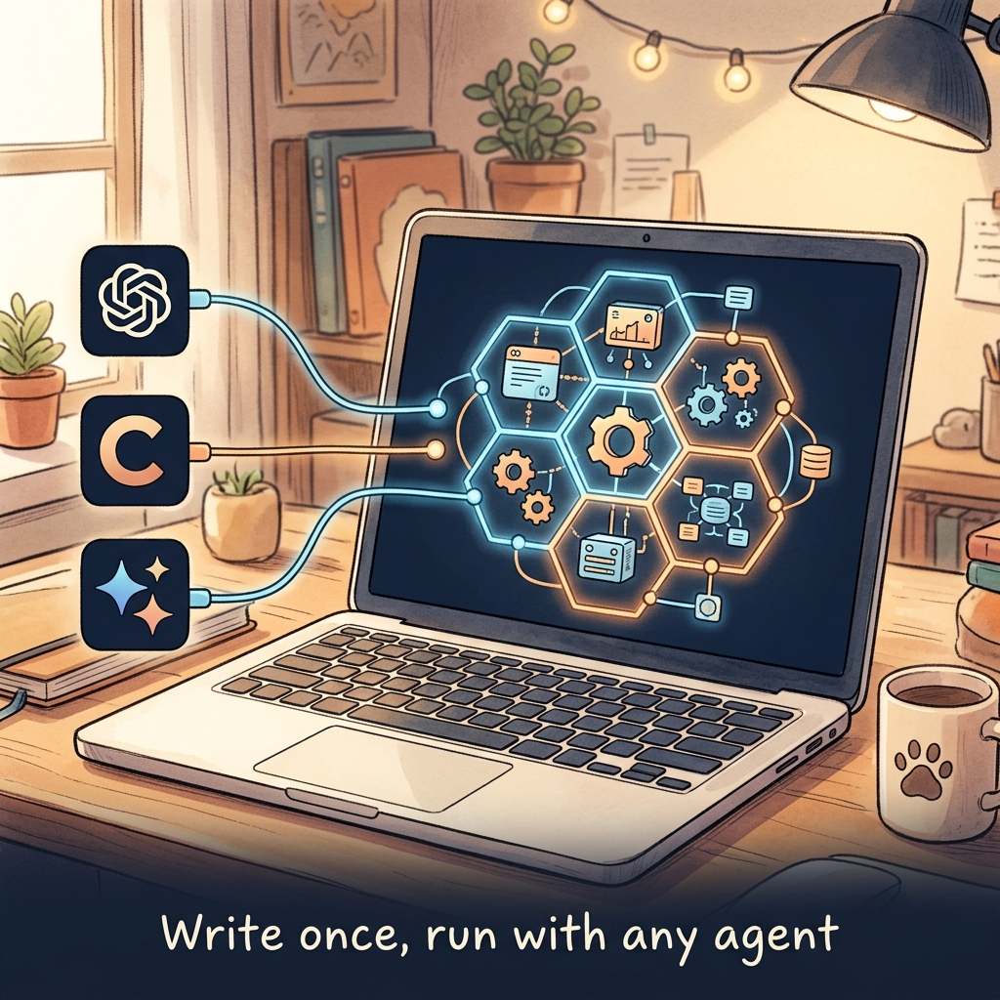
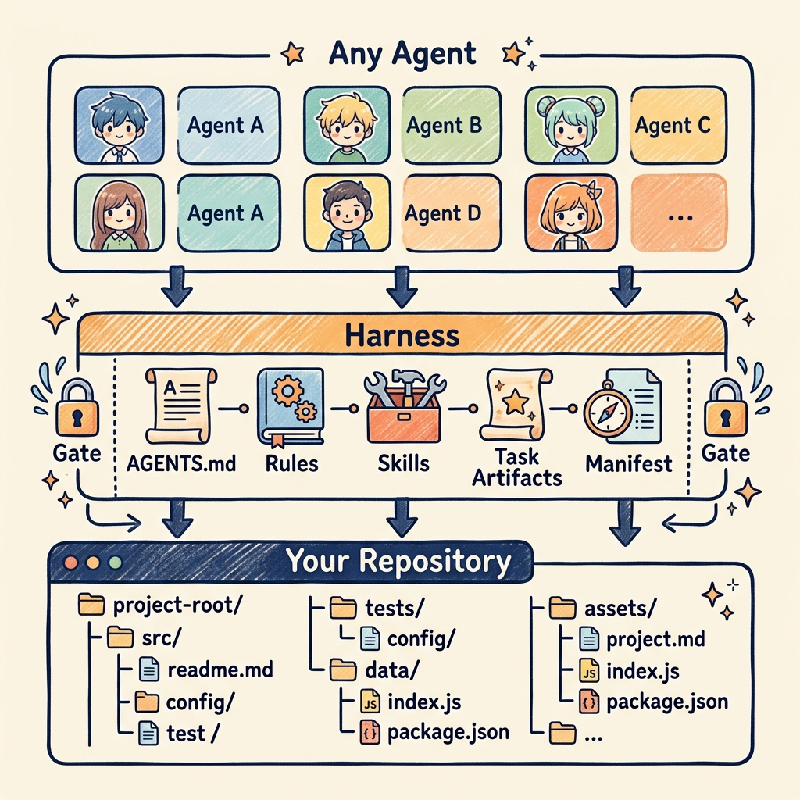
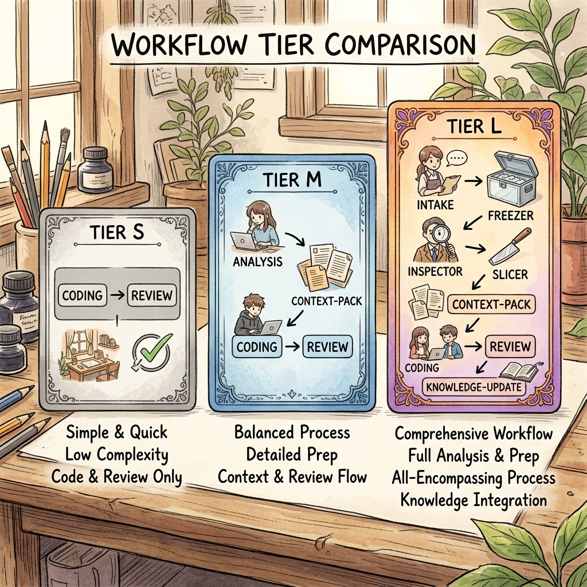
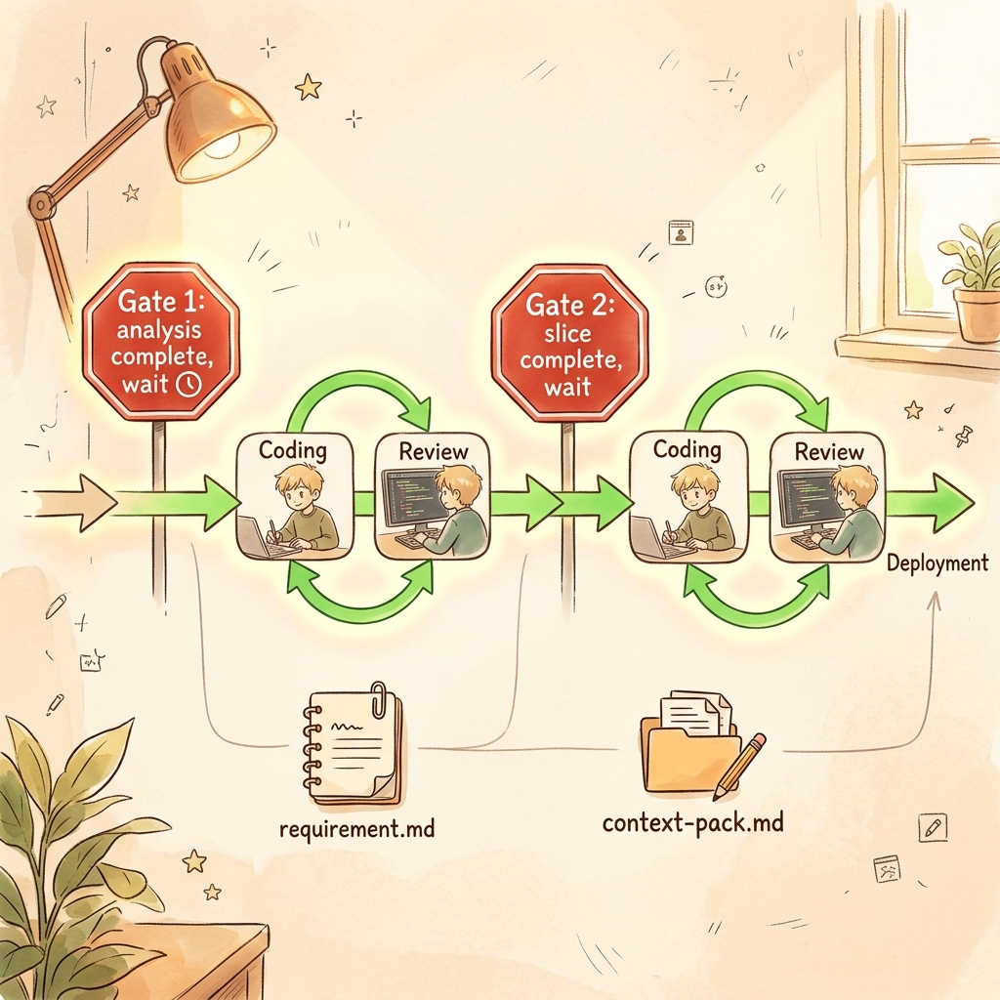
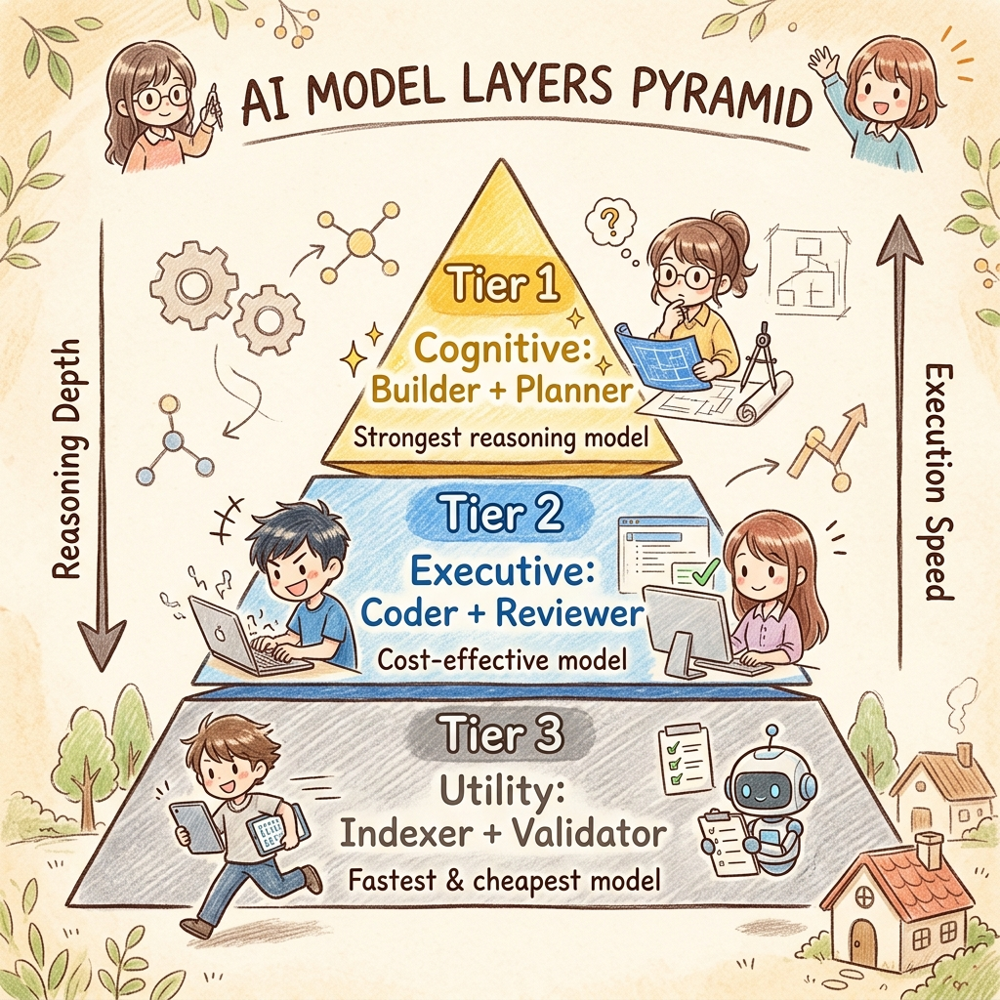
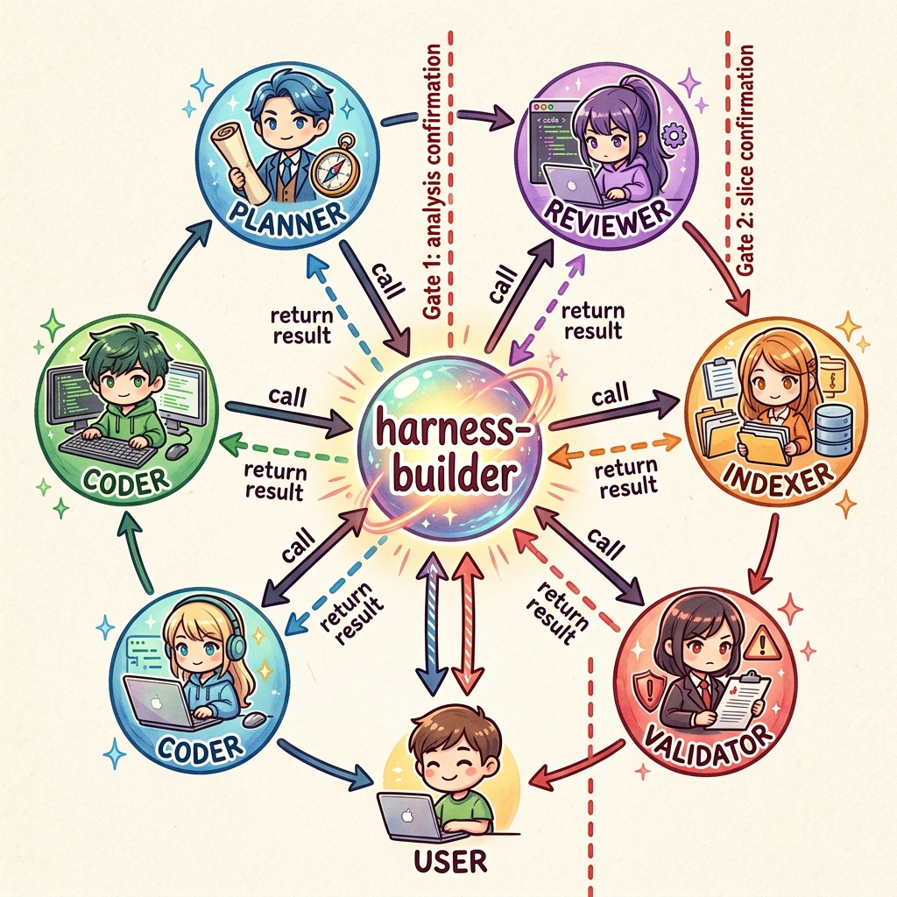
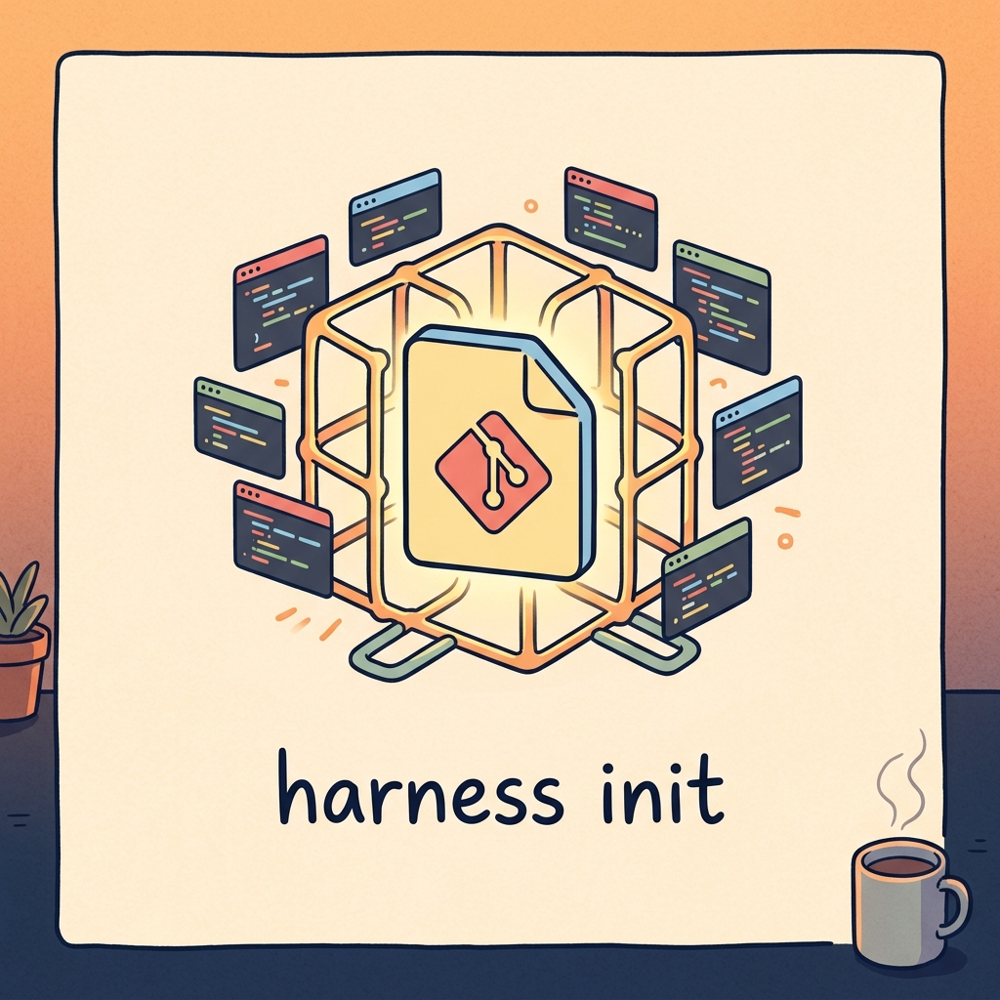

# 让 AI 编程从"赌运气"变成"可复现"——聊聊 Universal AI Harness Framework

> 不是新工具，是一套让 AI agent 老实干活的方法论。

---



---

## 你大概率遇到过这种情况

打开 Cursor 或者 Copilot Chat，跟 AI 说"帮我加个导出 CSV 的功能"。

它开始干活了。前 20 秒你很满意——它找到了相关模块，改了 service 层，加了 controller，还顺手帮你修了个拼写错误。然后你发现它把 ORM 查询改成了原生 SQL，"因为这样性能更好"。你又发现它在没经过你允许的情况下 refactor 了异常处理逻辑。你赶紧喊停，但已经有 8 个文件被改过了，其中 3 个跟导出 CSV 完全没关系。

这不是 AI 蠢，是协作方式不对。

你用自然语言给了一个意图，它用最大自由度去理解这个意图。没有约束、没有边界、没有 checkpoint。就像一个实习生接到"帮我优化一下代码"的指令后，把所有 for 循环改成了 parallel stream。

**AI coding 的瓶颈从来不是模型能力不够，而是我们缺少一套让协作变得可控的"契约"。**

这就是 Universal AI Harness Framework 要解决的问题。

---

## Harness 是什么

一句话：**一套落盘到仓库文件里的 AI 协作框架。**

它不是一个新的 AI 工具，不是某个 IDE 的插件，也不绑定任何一个 agent 平台。它做的事情很简单——在你的项目根目录下放一组文件，这些文件共同定义了一件事：

> "当 AI agent 进入这个仓库时，它应该用什么方式理解项目、遵循什么规则、在什么节点停下来等你确认。"

类比一下：如果说你的项目是一台车，不同的 AI agent（ChatGPT、Claude、Gemini、Copilot）是不同的轮胎，那 Harness 就是连接车身和轮胎的那套悬挂系统。轮胎可以换，但悬挂的标准是一致的。



---

## 为什么需要这套东西

三个最核心的原因：

### 1. 约束会丢失

你跟 AI 说"别改数据库 schema"，对话到第 15 轮的时候它很可能已经忘了这条指令。Harness 的做法是把约束写在 `.aiassistant/rules/*.md` 里，agent 每次读取项目上下文时都会重新加载。不是靠记忆，是靠文件。

### 2. 范围会漂移

"加个导出功能" → "顺便优化查询" → "这个 service 好像可以重构一下"。这不是 bug，是 LLM 在没有明确边界时的本能行为。Harness 强制每一个编码动作之前都先定义 **allowed scope 和 forbidden scope**，超出范围就停下来。

### 3. 过程不可审查

你用 AI 写了一段代码，几周后出了 bug。你能回忆起当时 AI 为什么会那么写吗？它是基于什么分析做的决定？如果当时有人 review 过了，凭什么过的？Harness 把每一次协作的关键产物（需求冻结、实现计划、上下文包、审查结论）都写成文件存在 `.task/` 里。不是聊天记录，是结构化的决策文档。

---

## 怎么做到的：四个核心设计

### 设计一：文件即契约

别指望 agent 记住你在对话里说过什么。把重要的东西写进文件：

| 文件                        | 用途                   |
| ------------------------- | -------------------- |
| `AGENTS.md`               | 仓库级入口指令，agent 进场先读这个 |
| `.aiassistant/rules/*.md` | 硬约束，例如"禁止直接操作生产数据库"  |
| `docs/**/*.md`            | 设计知识、架构决策、边界上下文      |
| `.task/`                  | 当前任务的需求、计划、上下文快照     |

这些是普通文件，可以被 git diff、code review、CI 检查——跟你写的代码一样受版本管理。

### 设计二：任务分级，不搞一刀切

不是所有任务都需要全套仪式。Harness 分了三个 tier：



- **Tier S**：拼写修复、注释更新、单文件小改动。直接编码加审查，不生成额外文档。
- **Tier M**：标准功能、边界清晰的 bugfix、小重构。先分析再编码，要求生成 `.task/<task-id>/context-pack.md`。
- **Tier L**：跨模块改动、高风险重构、需求模糊的复杂任务。完整走一遍需求冻结、模块检查、工作切片、逐片编码和审查。

这个分级的要点是：**不为小任务增加仪式感负担，但大任务必须受控。**

### 设计三：Gate 机制——该停就停

这是 Harness 方法论里最"反直觉"的一点：**agent 不是一路跑到终点的，它必须在你确认的关键节点停下来。**

核心 gate 只有两个：

1. **analysis → coding**：分析做完之后，编码之前，等你确认
2. **slice → next slice**：当前切片完成之后，下一片开始之前，等你确认

同一片内的 coding → review 可以自动流转，不需要你每步都点确认。这让 gate 聚焦在真正发生"范围变化"的节点上，而不是每行代码都打断你。



### 设计四：Skills 可编排，不绑定平台

Harness 的工作流不是硬编码的，而是通过 8 个独立的 skill 来组合：

```
task-intake → requirement-freezer → module-inspector / workflow-inspector
→ implementation-slicer → context-pack-builder → coding → boundary-reviewer
→ workspace-knowledge-manager
```

每个 skill 就是一段 Markdown 指令。这意味着你不用 Harness CLI 也能用这套方法——直接把这些 skill 内容粘贴给 ChatGPT 或者 Claude，告诉它"按这个流程走"，它一样能执行。

---

## 怎么开始用

### 第一步：初始化

在你的项目根目录跑一行命令：

```bash
harness init
```

这会在项目里装上全套"契约文件"。初始化只会写 framework-managed 的内容，你已有的文件不会被覆盖。

想先看看会装什么？加个 `--dry-run` 预览：

```bash
harness init --dry-run
```

### 第二步：初始化项目知识

让 agent 先理解你的项目，生成第一版设计文档和知识路由：

```text
使用 workspace-knowledge-manager init，帮我建立项目的设计知识和知识图谱。
```

### 第三步：补充团队规则

在 `AGENTS.md` 的 `project-local` 区域写上你们团队的默认规则，在 `.aiassistant/rules/` 里定义硬约束。

### 第四步：开始用

跟 agent 说话的方式变一下。不再说"帮我写个 XXX"，而是说：

```text
我要处理一个新功能：[描述你的需求]

请按照当前仓库的 harness workflow 推进。先做 task-intake，不要直接编码。
```

就这两句话——"按 harness workflow 推进"和"不要直接编码"——足够让一个合格的 agent 进入受控协作模式。

---

## OpenCode：Harness 的满血版体验

前面说的是"通用模式"——你可以在任何 agent 上用这套方法，但需要你把 skill 内容手动喂给 agent，或者手写提示词来触发 workflow。对日常高频使用来说，这种方式稍微有点磨人。

OpenCode 是 Harness 的"满血版"执行层。初始化时加一个参数：

```bash
harness init --with-opencode
```

它会额外安装一组东西：slash commands、本地 agent 角色定义、validator 脚手架。**装完之后，你不再需要手动拼提示词——harness-builder 这一个 agent 就能覆盖几乎全部的日常开发场景。**

这一点值得单独拎出来说，因为很多人对"多 agent 协作"的第一反应是"那我是不是得在几个 agent 之间来回切换"——不用。你自始至终只跟 `harness-builder` 对话。builder 内部会根据任务需要自动调度 planner、coder、reviewer、indexer、validator 这些子 agent，但对你来说这些是透明的。就像你不会自己手动调度 CPU 的各个核心一样，你只需要告诉操作系统"我要跑这个程序"。在这里，harness-builder 就是那个操作系统。

### 模型分层：好钢用在刀刃上

OpenCode 版最核心的设计不是"多 agent 并行干活"，而是 **把不同的模型分配给不同类型的任务**：



| 层级        | 角色                | 用的模型       | 为什么                      |
| --------- | ----------------- | ---------- | ------------------------ |
| Tier 1 思考 | builder、planner   | 你手上最强的推理模型 | 分析、规划、gate 决策质量决定整个任务的成败 |
| Tier 2 执行 | coder、reviewer    | 能力强但更便宜的模型 | 任务边界已经锁定，按规矩干活就行         |
| Tier 3 工具 | indexer、validator | 最便宜可靠的模型   | 读文件、跑构建、跑测试，不需要深度推理      |

这个分层很务实。不是每个步骤都值得花最贵的 token。把推理 budget 集中在最不确定的环节，执行类的活交给更高效的模型。

### harness-builder：日常只用这一个 agent

这是 OpenCode 版的最大卖点，也是最容易被低估的一点。

**你的日常工作只需要 `harness-builder` 这一个 agent。** 不需要在分析阶段切换到 planner、编码阶段切换到 coder、审查阶段切换到 reviewer——builder 会在内部自动完成所有调度。你的体验就是：丢需求过去 → 它分析完等你确认 → 确认后它开始写到写到审查一气呵成 → 审查完再等你确认要不要继续下一片。

它具体负责：

- 理解你的需求，判断该走 Tier S / M / L 哪条流程
- 调用 planner 冻结需求、拆分切片
- 调用 indexer 探索仓库结构
- 在 analysis gate 停下来等你确认
- 确认后调度 coder 去实现当前切片
- coder 干完自动触发 reviewer 审查
- 审查通过后在 slice gate 等你确认要不要继续



整个过程里，**你需要写的提示词可以非常简单**。不需要精心构造 prompt template，不需要手写 allowed scope，不需要手动管理 agent 之间的上下文传递。说 "我要做 XXX，走 harness workflow"，builder 就会接管后面的流程。

### 五个 slash commands，覆盖日常开发场景

OpenCode 装好之后，你会得到这几个命令：

| 命令                  | 什么时候用               |
| ------------------- | ------------------- |
| `/harness-feature`  | 新功能开发               |
| `/harness-bugfix`   | 修 bug（带上现象、预期、复现步骤） |
| `/harness-refactor` | 重构（带上目标和不变约束）       |
| `/harness-docs`     | 更新文档或规则             |
| `/harness-context`  | 重建当前切片的上下文包         |

这些命令都路由到 `harness-builder`。无论你选哪个命令，跟你对话的都是同一个 agent——你不用关心后面调了 planner 还是 coder，builder 自己会判断。**日常开发只需记住这一个 agent 就够了。**

### 顺便说一下：OpenCode 是可选件，不是锁死件

即使删掉 `.opencode/` 整个目录，你的仓库仍然能靠 `AGENTS.md`、rules、docs 和 skills 正常运行 Harness 流程。OpenCode 是让你更顺手的执行层，不是绑定你的锁链。

---

## 这套东西跟你的现状怎么结合

你不需要一次性把所有项目都切到 Harness 模式。推荐的节奏是：

1. 挑一个新项目或一个不那么紧急的功能，跑 `harness init --with-opencode`
2. 花 30 分钟让 `workspace-knowledge-manager` 初始化项目知识
3. 用 `/harness-feature` 完整走一遍 Tier M 流程，感受 gate 节奏
4. 如果觉得流程太重，确认一下你的任务是不是 Tier S 级别的小改动
5. 跑顺两三次之后，再往其他项目推广

**最关键的心态转变：** Harness 不是让 AI 写代码更快的工具，是让你对 AI 写的代码更有信心的工具。它确实会多几个"等你确认"的步骤，但这些步骤省掉的时间，会在你盯着 diff 一行行猜"这个改动到底有没有必要"的时候加倍还给你。

---

## 总结

三个要点带走：

1. **文件约束 > 对话约束。** 你写在 `AGENTS.md` 和 rules 里的东西，比你在聊天窗口里打了 15 轮的话都管用。
2. **Gate 让范围不会漂移。** Analysis → 确认 → Coding → Review → 确认 → 下一片。没有 gate 的 agent 就像一个没有 commit message 的 git log。
3. **OpenCode 是满血版，但你不需要一开始就全开。** 先用基础版理解 Harness 的方法论，再上 OpenCode。上 OpenCode 之后，记住你只需要 `harness-builder` 这一个 agent——日常开发的所有场景它都能覆盖。

---

这套 framework 的设计原则之一就是"可编辑的本地脚手架，不是锁死的系统"。

---



---

*仓库地址：https://github.com/pandaria75/universal-ai-harness-framework*
