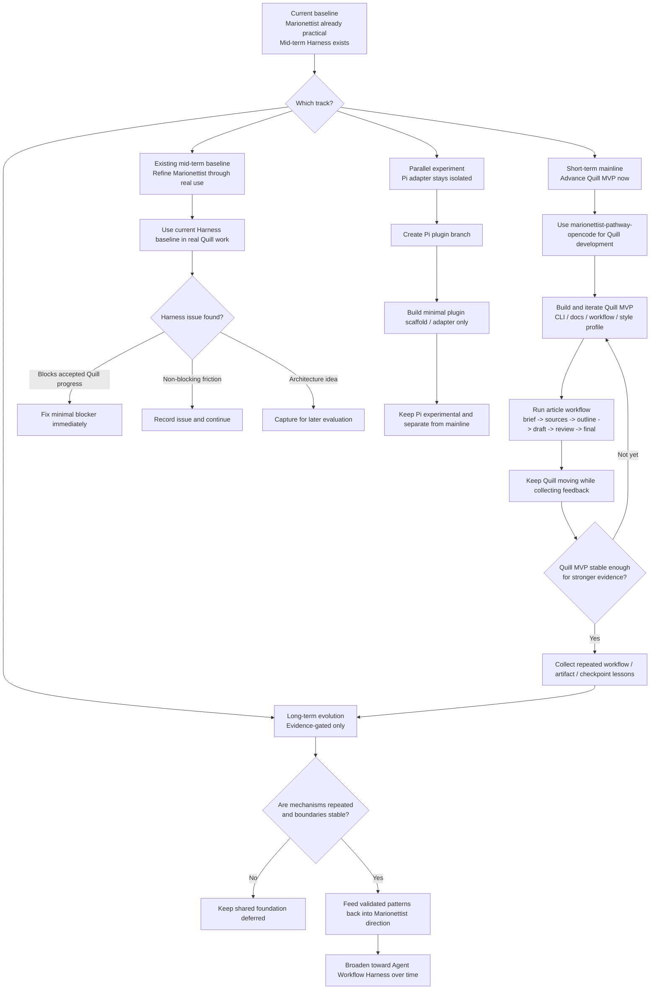

# Project Sequencing

## Strategy

Quill MVP is the mainline. Marionettist optimization is the feedback loop. Pi plugin work is a parallel experiment. Shared foundation is a delayed abstraction, not a current prerequisite.

This sequencing assumes Marionettist already has a stable enough mid-term Harness baseline to support forward motion now. The short-term need is not to re-prove basic viability, but to use real work to advance Quill, surface small issues, and collect evidence for later long-term decisions.

## Operating rules

1. Use `marionettist-pathway-opencode` to develop Quill.
2. Let Quill development expose real Marionettist problems.
3. Fix Harness issues immediately when they block Quill MVP.
4. Record non-blocking experience issues as Marionettist roadmap issues.
5. Delay pure architecture optimization.
6. Explore Pi plugin work on a separate branch.
7. Keep shared foundation work to documentation and evaluation until evidence exists.

## Issue handling during Quill work

- `blocking`: fix immediately.
- `non-blocking`: create an issue and roadmap it.
- `architecture-idea`: record for later evaluation.
- `future-work`: track after Quill MVP stabilizes.

See `01-quill-dogfooding-plan.md` for the detailed feedback protocol, required issue fields, and blocker triage rules.

## Sequence

- Phase 0: synchronize Marionettist docs and roadmap so short-term and long-term direction are explicit.
- Phase 1: use the existing Marionettist/OpenCode baseline to keep Quill MVP advancing.
- Phase 2: fix only genuinely blocking Marionettist problems immediately; record non-blocking friction for gradual follow-up.
- Phase 3: create `feature/pi-plugin-adapter` and validate a minimal Pi adapter in parallel without changing the Quill mainline.
- Phase 4: after Quill produces 2-3 real articles, collect workflow / artifact / checkpoint lessons from actual use.
- Phase 5: evaluate whether stable mechanisms should feed back into Marionettist long-term direction.
- Phase 6: decide later whether any shared foundation is justified.

The long-term branch is intentionally evidence-gated. Pi remains experimental, and shared foundation work stays deferred unless repeated mechanisms survive real use across more than one workflow context.
