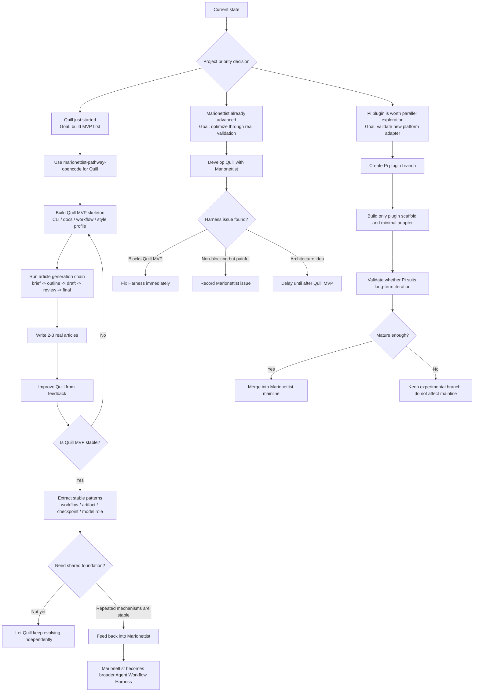

# Project Sequencing

## Strategy

Quill MVP is the mainline. Marionettist optimization is the feedback loop. Pi plugin work is a parallel experiment. Shared foundation is a delayed abstraction, not a current prerequisite.

## Operating rules

1. Use `marionettist-pathway-opencode` to develop Quill.
2. Let Quill development expose real Marionettist problems.
3. Fix Harness issues immediately when they block Quill MVP.
4. Record non-blocking experience issues as Marionettist roadmap issues.
5. Delay pure architecture optimization.
6. Explore Pi plugin work on a separate branch.
7. Keep shared foundation work to documentation and evaluation until evidence exists.

## Issue handling during Quill work

- Blocking Quill MVP: fix immediately.
- Non-blocking but painful: create issue and roadmap it.
- Architecture-only: record as future work after Quill MVP.

## Sequence

- Phase 0: synchronize Marionettist docs and roadmap.
- Phase 1: use `marionettist-pathway-opencode` to develop Quill MVP.
- Phase 2: create `feature/pi-plugin-adapter` and validate a minimal Pi adapter in parallel.
- Phase 3: after Quill produces 2-3 real articles, collect workflow / artifact / checkpoint lessons.
- Phase 4: evaluate whether stable mechanisms should feed back into Marionettist.
- Phase 5: decide whether to extract a shared foundation.

